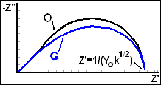

# Gerischer Element

Copy from site: http://consultrsr.net/resources/eis/gerischer.htm

## Gerischer

The Gerischer ( **G** ) circuit element was first derived for a preceding chemical reaction happening in the bulk solution. This is the so called **CE** mechanism.
$$
A\stackrel{k}\longrightarrow Ox\stackrel{ne^-}\longrightarrow Red
$$
A Gerischer  has also been used to model a porous electrode[^1]

> Gerischer原件主要用于描述前置CE反应与多空电极过程

On a Nyquist plot, it looks quite a lot like the O diffusion element (diffusion through a thin layer).

A Nyquist plot for the <strong>G</strong> element. It is not as high as an <strong>O</strong> element with the same intercept. The value of the low frequency intercept for the Gerischer is shown

The figure shows the Nyquist plot for the **G** diffusion element. The **G** element is characterized by two parameters. 

- an "admittance" parameter, **Yo** (units S-s1/2), 
- and a "rate constant" parameter, **k** (units: s-1). 

At high frequency the **G** circuit element is indistinguishable from a Warburg impedance! **At high frequency, it presents a 45° line on the Nyquist plot and a straight line with slope of -1/2 on the Bode magnitude plot.**

> 在高频下，G原件和W原件无法区分，均表现为45°的直线

## Gerischer Equations

The equations for the complex impedance (**$Z(\omega)$** ) and complex admittance
( **$Y(\omega)$** ) are given by the equations below. [^2] 
$$
\mathop{A}\limits ^{\rightarrow}(\omega)=1/{Y_0 \sqrt{k+j\omega}}
$$
$$
\mathop{Y}\limits ^{\rightarrow}(\omega)=Y_0 \sqrt{k+j\omega}
$$

**Yo** has the same definition as for the Warburg impedance. **Yo** can be used to calculate the diffusion coefficient for the mobile species using the same equations as for the Warburg. The high frequency region can be used to estimate **Yo**.

## REFERENCE

[^1]: (2) "[Impedance Studies on Chromite-Titanate Porous Electrodes under Reducing Conditions](http://dx.doi.org/10.1002/1615-6854(200112)1:3/4<256::AID-FUCE256>3.0.CO;2-I)", Gonzalez-Cuenca, Zipprich, Boukamp, Pudmich, Tietz, *Fuel Cells*, **1** (2001), 256-264.
[^2]: Equivalent Circuit (EQUIVCRT.PAS) Users Manual", [Boukamp, B](http://www.ims.tnw.utwente.nl/people/bab/bab.doc/), Univ. Twente, Enschede, the Netherlands, 1989.